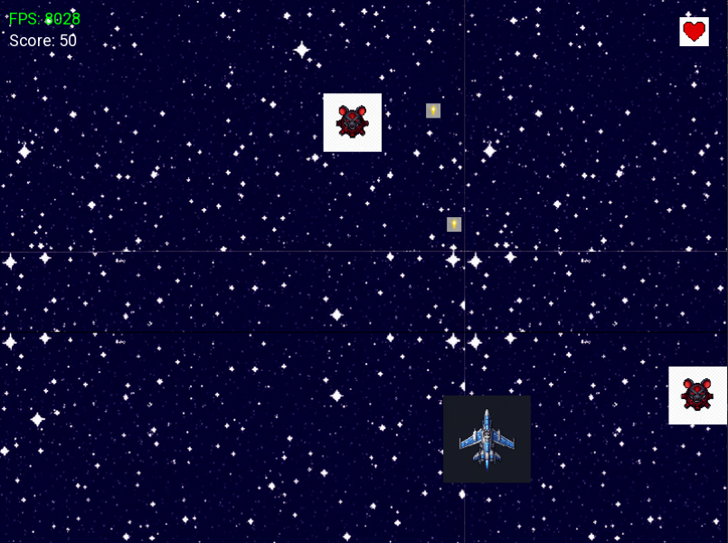
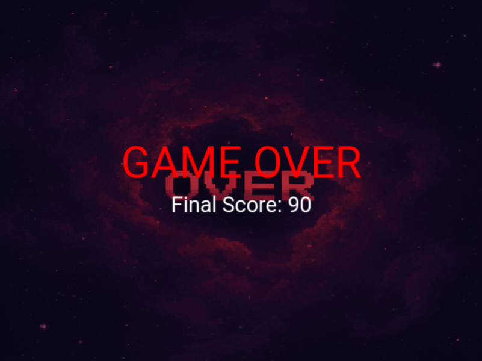

# 🚀 AI-Assisted Space Shooter — Vibe-Coded с C++17 и SFML 3.0

[](README.ru.md) | [](README.md)

[](https://github.com/ann4ann/SFML-game-AI/actions/workflows/build.yml)


> 2D космический шутер, созданный с использованием **vibe-coding (AI-assisted разработки)** на C++17 и SFML 3.0.
> Все ассеты (спрайты, звуки) генерируются AI-инструментами, которые интегрированы как MCP-серверы.
> 
> **[📖 Об AI-воркфлоу →](docs/AI_WORKFLOW.ru.md)**

---

## 📸 Скриншоты

| Геймплей | Game Over |
|----------|-----------|
|  |  |

### Видео геймплея

<video src="assets/screenshots/gameplay_video.mp4" controls width="640"></video>

---

## 🎮 О проекте

Этот проект демонстрирует **современную AI-assisted разработку ПО** (полноценной 2D-игры) в сотрудничестве человека-разработчика и AI-агентов. Проект задуман как:

- 🎯 **Проект-портфолио** — чистая архитектура, тесты, CI/CD и документация
- 📚 **Обучающий ресурс** — изучите, как работает ECS-lite, как AI генерирует игровые ассеты и как vibe-coding следует структурированному процессу
- 🔬 **Эксперимент** — исследование границ и возможностей AI-генерируемого игрового кода

### Возможности

- ✅ Управление игроком (стрелки / WASD) с диагональной нормализацией и ограничением экрана
- ✅ Спавн врагов (по таймеру, случайный X, движение вниз)
- ✅ Стрельба пулями (клавиша Space, кулдаун 250 мс) с автоочисткой
- ✅ AABB-детекция коллизий (SFML 3.0 `findIntersection`)
- ✅ Система очков (+10 за убийство) и жизней (3 жизни)
- ✅ Анимации взрывов (4-кадровый спрайтшит)
- ✅ Звуковые эффекты (лазер, попадание, взрыв — все сгенерированы)
- ✅ Звёздное поле с бесконечной вертикальной прокруткой
- ✅ Экран Game Over с финальным счётом
- ✅ AI-генерированные пиксель-арт текстуры и спрайты
- ✅ Fallback для текстур — играбельно даже без ассетов
- ✅ 14 юнит-тестов (Catch2) для основной игровой логики

---

## 🤖 AI Воркфлоу

Этот проект разработан с использованием структурированного процесса **vibe-coding**:

1. **Определение задачи** — Человек описывает функциональность
2. **Загрузка контекста** — AI читает `PROJECT_CONTEXT.md` для полного состояния проекта
3. **Feature - ветка** — Создаётся через *git-ops* MCP сервер
4. **Реализация** — AI пишет код, следуя соглашениям `.clinerules`
5. **Сборка и тестирование** — Проверяется через *test-build* MCP сервер
6. **Коммит** — Conventional Commits через *git-ops* MCP
7. **Документация** — Обновляются `dev-journal.md`, `progress.md`, `activeContext.md`
8. **Пуш** — Через *git-ops* MCP

### Используемые MCP-серверы

| Сервер | Назначение | Ассеты |
|--------|------------|--------|
| 🔧 **git-ops** | Git-операции (ветка, коммит, пуш) | — |
| 🎨 **image-gen** | AI-генерация ассетов | Корабль игрока, враги, пули, взрывы, иконки |
| 🔊 **sound-gen** | Процедурное WAV-аудио (5 типов) | Лазер, попадание, взрыв |
| ✅ **test-build** | Конфигурация, сборка и тестирование | — |

**[📖 Детальная документация AI-воркфлоу →](docs/AI_WORKFLOW.ru.md)**

---

## 🏗️ Архитектура

Игра использует **ECS-lite (Entity-Component-System)** паттерн:

```
process_events() → update(dt) → render()
```

| Слой | Описание |
|------|----------|
| **Entity** | `EntityId` (uint32_t) — лёгкий handle, 0 = INVALID |
| **Components** | Простые структуры данных: Transform, Velocity, Sprite, Health и т.д. |
| **ComponentManager** | Type-erased maps: `EntityId → Component` |
| **Systems** | Классы логики: PlayerMovement, EnemySpawn, Collision и т.д. |
| **Game** | Оркестратор: владеет ComponentManager, системами, ассетами |

**[📖 Полная документация архитектуры →](docs/ARCHITECTURE.md)**

### Список компонентов

| Компонент | Поля | Роль |
|-----------|------|------|
| `Transform` | `sf::Vector2f position` | Позиция в мире |
| `Velocity` | `sf::Vector2f velocity` | Скорость в секунду |
| `Sprite` | `shared_ptr<sf::Texture>`, `unique_ptr<sf::Sprite>` | Текстурированный визуал |
| `Shape` | `sf::RectangleShape rect` | Fallback / хитбокс |
| `PlayerTag` | *(маркер)* | Идентифицирует игрока |
| `EnemyTag` | *(маркер)* | Идентифицирует врагов |
| `BulletTag` | *(маркер)* | Идентифицирует пули |
| `Health` | `int hp` | Очки здоровья |
| `Lifetime` | `float remaining` | Таймер автоудаления |
| `ExplosionAnim` | Покадровые данные анимации | Спрайтшит-анимация |

### Список систем

| # | Система | Ответственность |
|---|---------|-----------------|
| 1 | `PlayerMovementSystem` | Ввод с клавиатуры, нормализация диагоналей, стрельба |
| 2 | `EnemySpawnSystem` | Спавн по таймеру (интервал 2 с) |
| 3 | `MovementSystem` | `position += velocity × dt` |
| 4 | `CollisionSystem` | AABB-детекция, подсчёт очков, взрывы |
| 5 | `BulletCleanupSystem` | Удаление пуль за экраном / с истёкшим временем |
| 6 | `ExplosionAnimationSystem` | Покадровая анимация |

---

## CI/CD воркфлоу

GitHub Actions воркфлоу (`build.yml`):

- **Триггер**: Пуш в release-ветки, PR в любую ветку, ручной запуск
- **Окружение**: Ubuntu 26.04 с SFML 3.0 через apt
- **Шаги**: Установка зависимостей → Конфигурация → Сборка → Тестирование (14 юнит-тестов)
- **Оптимизация**: Concurrency group, paths-ignore для docs/assets

---

## 📦 Структура проекта

```
AI-SFML-game/
├── .clinerules                 # Конфигурация AI-агента
├── CHANGELOG.md                # История версий
├── CMakeLists.txt              # Система сборки
├── LICENSE                     # MIT License
├── PROJECT_CONTEXT.md          # Единый источник истины для AI
├── README.md                   # ← Английская версия
├── README.ru.md                # ← Вы здесь (Русская версия)
├── assets/
│   ├── fonts/Roboto.ttf        # Шрифт UI
│   ├── imgs/                   # AI-генерированные спрайты
│   └── sounds/                 # AI-генерированные звуки
├── dev-journal.md              # Ежедневный лог разработки
├── docs/
│   ├── AI_WORKFLOW.md          # Гайд по AI-assisted разработке
│   ├── AI_WORKFLOW.ru.md       # Русская версия AI-воркфлоу
│   └── ARCHITECTURE.md         # ECS-lite документация
├── memory-bank/                # AI-контекст (activeContext, progress и т.д.)
├── mcp-servers/                # Реализации кастомных MCP-серверов
├── src/
│   ├── main.cpp                # Точка входа
│   ├── Game.hpp / Game.cpp     # Оркестрация игры
│   ├── Config.hpp              # Все константы игрового баланса
│   ├── ecs/                    # ECS-ядро (Entity, ComponentManager, System)
│   ├── systems/                # Игровые системы (6 реализовано)
│   └── scenes/                 # (запланировано)
└── tests/                      # Catch2 юнит-тесты (14 тестов)
```

---

## 🔧 Локальная разработка

### Требования

| Зависимость | Версия | Примечания |
|-------------|--------|------------|
| CMake | 3.15+ | Система сборки |
| C++17 компилятор | g++, clang, MSVC | Любой C++17-совместимый компилятор |
| SFML | 3.0 | Graphics, Window, System, Audio, Network |
| Catch2 | 3.4.0 | Опционально, для тестов (автозагрузка) |

### Windows (с MinGW)

```bash
# Установите MSYS2 UCRT64: https://www.msys2.org/
# Установите SFML:
pacman -S mingw-w64-ucrt-x86_64-sfml

# Сборка и запуск
cmake -B build -G "MinGW Makefiles"
cmake --build build
./build/space-shooter.exe
```

### Linux (Ubuntu/Debian)

```bash
# Установите SFML 3.0
sudo apt-get install libsfml-dev

# Сборка и запуск
cmake -B build -DCMAKE_BUILD_TYPE=Debug
cmake --build build
./build/space-shooter
```

### macOS

```bash
# Установите SFML через Homebrew
brew install sfml

# Сборка и запуск
cmake -B build -DCMAKE_BUILD_TYPE=Debug
cmake --build build
./build/space-shooter
```

### Запуск тестов

```bash
cmake -B build -DCMAKE_BUILD_TYPE=Debug -DBUILD_TESTING=ON
cmake --build build
cd build && ctest --output-on-failure
```

---

## 🗺️ План развития

- [ ] Главное меню
- [ ] Windows CI-матрица
- [ ] Усиления и щиты
- [ ] Битвы с боссами
- [ ] Сохранение рекордов
- [ ] Поддержка геймпада

---

## 📜 Лицензия

Этот проект лицензирован под **MIT License** — подробнее в [LICENSE](LICENSE).

### Лицензии сторонних компонентов

| Зависимость | Лицензия |
|-------------|----------|
| [SFML 3.0](https://www.sfml-dev.org/) | zlib/pg |
| [Catch2](https://github.com/catchorg/Catch2) | BSL-1.0 |
| [Шрифт Roboto](https://fonts.google.com/specimen/Roboto) | Apache 2.0 |