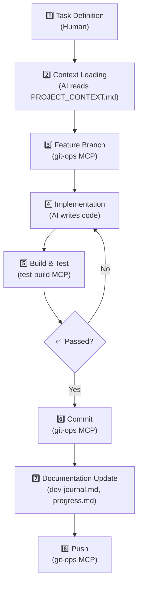
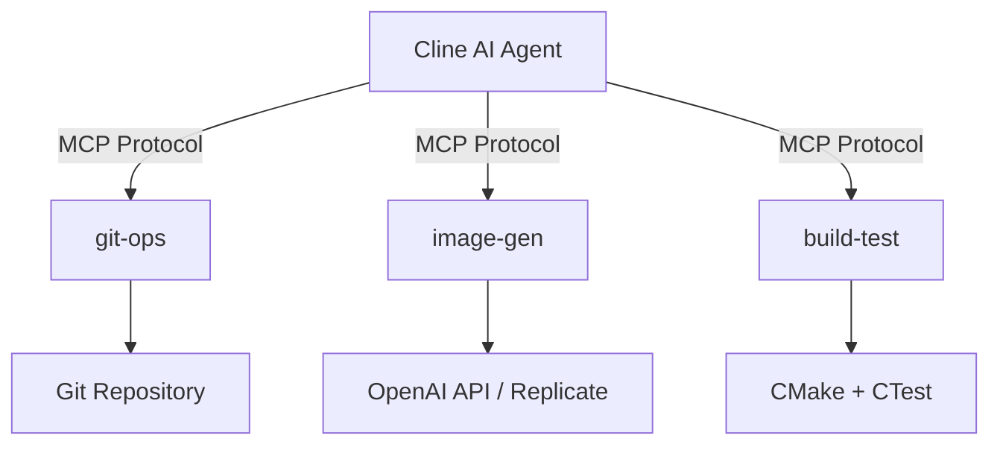
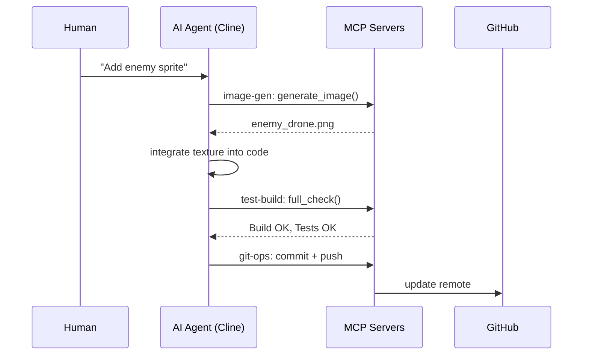
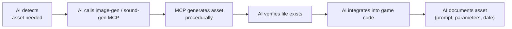

# AI-Assisted Development Workflow

> This document describes how AI tools (Cline, MCP servers) were used to develop this game. It serves as both documentation and a teaching resource for **vibe-coding** — AI-assisted software development.

## What is Vibe-Coding?

Vibe-coding is a development approach where an AI agent (like Cline) takes on the role of a senior developer, guided by natural language instructions and structured project context. The human provides direction, reviews changes, and makes architectural decisions — the AI handles implementation.

## Workflow Overview

## Key Components

### 1. `.clinerules` — AI Agent Configuration

This file defines rules for the AI agent, with the following priorities:
- **Feature development workflow** — step-by-step process for implementing features
- **Token optimization strategies** — critical rules for efficient AI context usage
- **MCP server rules** — asset generation, git operations, and build-test integration
- **Coding conventions** — C++17, naming, smart pointers
- **Commit message format** — Conventional Commits

### 2. `PROJECT_CONTEXT.md` — Single Source of Truth

A comprehensive document that the AI reads first before any implementation. It contains:
- Build commands
- Architecture overview
- Complete component and system inventory
- Asset list
- Conventions
- Git workflow
- MCP server references

### 3. Memory Bank — Project Context for AI

Persistent AI context across sessions:

| File | Purpose |
|------|---------|
| `activeContext.md` | Current task, active decisions |
| `productContext.md` | Stable project overview |
| `progress.md` | Global status of nearest tasks |
| `systemPatterns-core.md` | Architecture invariants (ECS-lite design) |
| `systemPatterns-currentSet.md` | Current component/system inventory |
| `systemPatterns-details.md` | Non-critical patterns |

### 4. `dev-journal.md` — Development Log

A daily log of what was done, why it matters, and lessons learned. This serves as both project history and a teaching resource showing the real development process.

## MCP Servers — AI Tool Integration

MCP (Model Context Protocol) servers extend the AI's capabilities. This project uses four custom MCP servers:

### git-ops
- **Tools**: `status`, `create_branch`, `commit`, `push`
- **Purpose**: All git operations without leaving the AI interface
- **Integration**: Wraps git commands — creates branches, stages, commits, and pushes

### image-gen
- **Tools**: `generate_image`
- **Purpose**: Procedural pixel-art generation (Flux-2 model)
- **Integration**: Calls external AI image API (OpenAI / Replicate) to generate textures
- **Assets generated**: player ship, enemy drone, starfield, bullets, explosion spritesheet, icons

### sound-gen
- **Tools**: `generate_sound`
- **Purpose**: Procedural WAV audio generation (5 types: laser, explosion, powerup, hit, pickup)
- **Integration**: Pure Python synthesizer — generates waveforms procedurally
- **Assets generated**: laser shot, enemy hit, enemy explosion sounds

### test-build
- **Tools**: `configure`, `build`, `test`, `full_check`
- **Purpose**: CMake configuration, compilation, and test execution
- **Integration**: Wraps CMake + CTest — verifies every change automatically

## MCP Server Interaction — Sequence

## AI-Assisted Asset Pipeline

## See Also

- [Architecture](ARCHITECTURE.md) — ECS-lite design details
- [.clinerules](../.clinerules) — AI agent configuration
- [dev-journal.md](../dev-journal.md) — daily development log
- [PROJECT_CONTEXT.md](../PROJECT_CONTEXT.md) — project context for AI