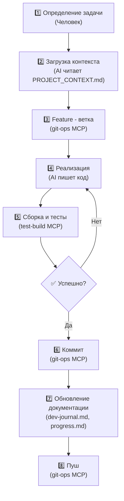
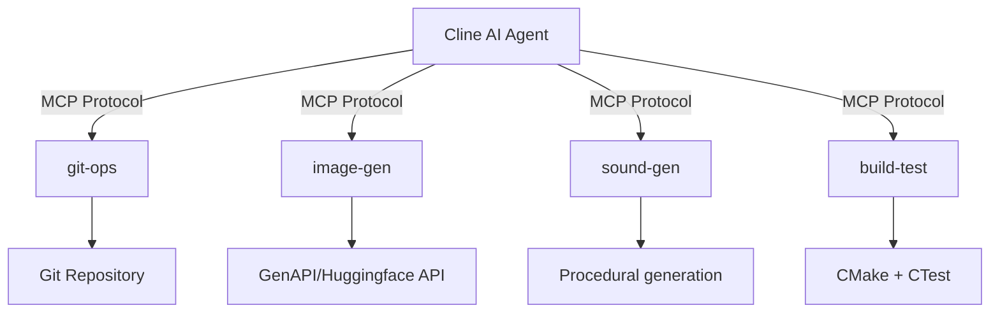
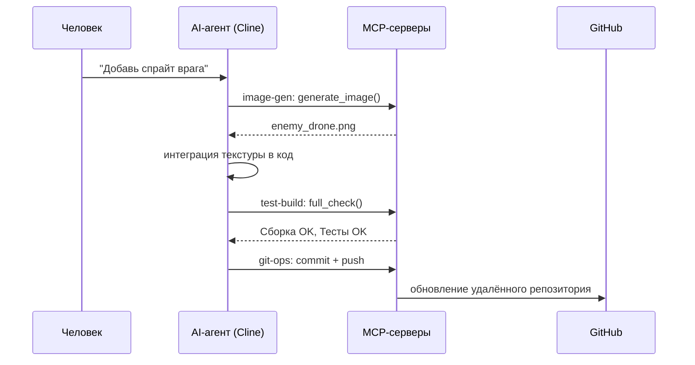
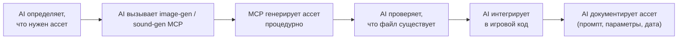

# AI-воркфлоу разработки

 | 

> В этом документе описано, как AI-инструменты (Cline, MCP-серверы) использовались для разработки этой игры. Он служит как документацией, так и обучающим ресурсом по **vibe-coding** — AI-assisted разработке ПО.

## Что такое Vibe-Coding?

Vibe-coding — это подход к разработке, при котором AI-агент (например, Cline) берёт на себя роль старшего разработчика, руководствуясь инструкциями на естественном языке и структурированным контекстом проекта. Человек задаёт направление, проверяет изменения и принимает архитектурные решения — AI занимается реализацией.

## Обзор воркфлоу

## Ключевые компоненты

### 1. `.clinerules` — Конфигурация AI-агента

Этот файл определяет правила для AI-агента со следующими приоритетами:
- **Feature-воркфлоу** — пошаговый процесс реализации функциональности
- **Оптимизация токенов** — критические правила для эффективного использования контекста AI
- **Правила MCP-серверов** — генерация ассетов, git-операции и интеграция сборки/тестов
- **Соглашения по коду** — C++17, именование, умные указатели
- **Формат коммитов** — Conventional Commits

### 2. `PROJECT_CONTEXT.md` — Единый источник истины

Комплексный документ, который AI читает в первую очередь перед любой реализацией. Содержит:
- Команды сборки
- Обзор архитектуры
- Полный список компонентов и систем
- Список ассетов
- Соглашения
- Git-воркфлоу
- Ссылки на MCP-серверы

### 3. Memory Bank — Контекст проекта для AI

Постоянный контекст AI между сессиями:

| Файл | Назначение |
|------|------------|
| `activeContext.md` | Текущая задача, активные решения |
| `productContext.md` | Обзор проекта (стабильный) |
| `progress.md` | Глобальный статус (ближайшие задачи) |
| `systemPatterns-core.md` | Инварианты архитектуры (ECS-lite) |
| `systemPatterns-currentSet.md` | Список текущих компонентов/систем |
| `systemPatterns-details.md` | Некритичные паттерны |

### 4. `dev-journal.md` — Лог разработки

Ежедневный лог того, что было сделано, почему это важно и какие уроки были извлечены. Служит историей проекта и обучающим ресурсом, который показывает реальный процесс разработки.

## MCP-серверы — Интеграция AI-инструментов

MCP (Model Context Protocol) серверы расширяют возможности AI. В этом проекте используются четыре кастомных MCP-сервера:

### git-ops
- **Инструменты**: `status`, `create_branch`, `commit`, `push`
- **Назначение**: Все git-операции без выхода из AI-интерфейса
- **Интеграция**: Обёртка над git-командами — создаёт ветки, индексирует, коммитит и пушит

### image-gen
- **Инструменты**: `generate_image`
- **Назначение**: Процедурная генерация пиксель-арта (модель Flux-2)
- **Интеграция**: Вызывает внешний AI-API (GenAPI/Huggingface) для генерации текстур
- **Сгенерированные ассеты**: корабль игрока, вражеский дрон, звёздное поле, пули, спрайтшит взрыва, иконки

### sound-gen
- **Инструменты**: `generate_sound`
- **Назначение**: Процедурная генерация WAV-аудио (5 типов: лазер, взрыв, усиление, попадание, подбор)
- **Интеграция**: Чистый Python-синтезатор — процедурно генерирует звуковые волны
- **Сгенерированные ассеты**: звуки лазерного выстрела, попадания по врагу, уничтожения врага

### test-build
- **Инструменты**: `configure`, `build`, `test`, `full_check`
- **Назначение**: Конфигурация CMake, компиляция и выполнение тестов
- **Интеграция**: Обёртка над CMake + CTest — автоматически проверяет каждое изменение

## Взаимодействие MCP-серверов — Последовательность

## AI-пайплайн ассетов

## См. также

- [Архитектура](ARCHITECTURE.md) — детали ECS-lite дизайна
- [.clinerules](../.clinerules) — конфигурация AI-агента
- [dev-journal.md](../dev-journal.md) — ежедневный лог разработки
- [PROJECT_CONTEXT.md](../PROJECT_CONTEXT.md) — контекст проекта для AI