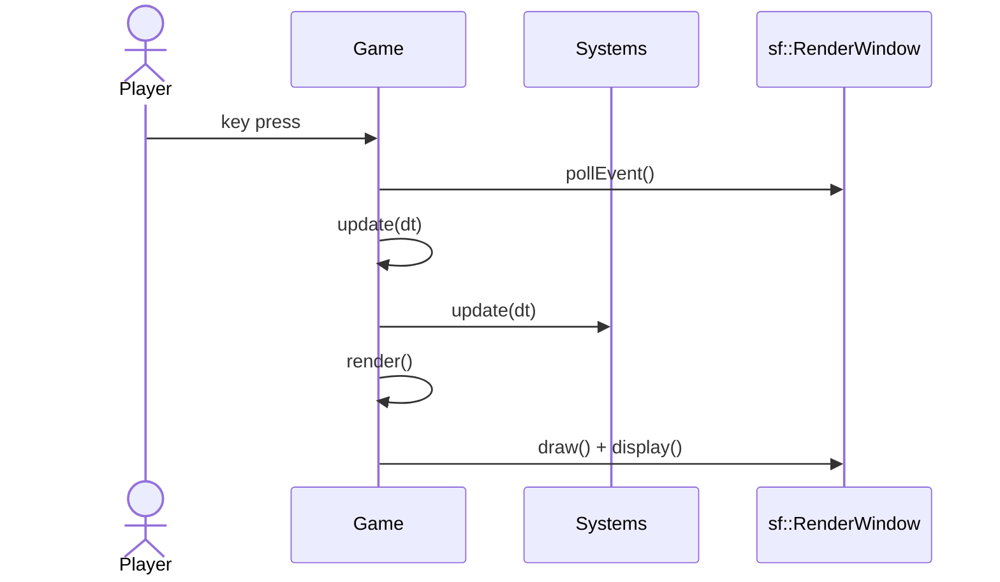
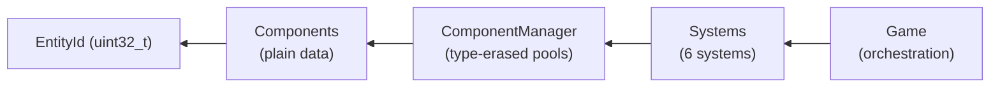

# Architecture — ECS-lite Design

> This document describes the game's architecture for developers, students, and educators.

## Overview

The game uses a lightweight **Entity-Component-System (ECS)** pattern. Unlike full ECS libraries (EnTT, etc.), this is a custom minimal implementation tailored for a 2D space shooter.

### Why ECS-lite?

- **Separation of concerns** — game logic is isolated from rendering
- **Data-oriented** — components are plain structs, systems operate on component pools
- **Extensible** — adding new features means adding components and systems without touching existing code
- **Educational** — clean example of ECS principles without framework overhead

## Game Loop

```
process_events() → update(dt) → render()
```

- `dt` = delta time in seconds (from `sf::Clock`)
- Systems are updated in registration order (defined in `Game` constructor)



## Layer Architecture



| Layer | Description |
|-------|-------------|
| **Game** | Owns ComponentManager, systems vector, entity counter, assets |
| **Systems** | Update logic, operate on ComponentManager |
| **ComponentManager** | Type-erased maps: `EntityId → Component` |
| **Components** | Plain data structs: Transform, Velocity, Health, etc. |
| **Entity** | `EntityId` (uint32_t) — lightweight handle, 0 = INVALID |

## Key Design Decisions

### Two-Phase Removal

To avoid iterator invalidation when removing entities during system iteration:

1. **Phase 1**: Collect pending entity IDs during iteration
2. **Phase 2**: Remove all collected entities after iteration completes

This is used in `CollisionSystem` and `BulletCleanupSystem`.

### Entity ID Management

- `Game::next_entity_id_` is the single shared counter
- Systems receive an `EntityId*` pointer to request new IDs
- `INVALID_ENTITY = 0` (never assigned)

### Texture Fallback

If an AI-generated texture fails to load, the game falls back to colored `sf::RectangleShape` rectangles. This ensures the game is always playable even without assets.

## Component Inventory

| Component | Fields | Role |
|-----------|--------|------|
| `Transform` | `sf::Vector2f position` | World position |
| `Velocity` | `sf::Vector2f velocity` | Movement per second |
| `Sprite` | `shared_ptr<sf::Texture>`, `unique_ptr<sf::Sprite>` | Textured visual (move-only) |
| `Shape` | `sf::RectangleShape rect` | Fallback visual / hitbox |
| `PlayerTag` | *(marker)* | Identifies player |
| `EnemyTag` | *(marker)* | Identifies enemies |
| `BulletTag` | *(marker)* | Identifies bullets |
| `Health` | `int hp` | Hit points |
| `Lifetime` | `float remaining` | Auto-removal timer |
| `ExplosionAnim` | `current_frame, total_frames, frame_timer, frame_duration, frame_size, remove_on_finish` | Frame-based animation |

## System Inventory

| # | System | Responsibility |
|---|--------|----------------|
| 1 | `PlayerMovementSystem` | Keyboard input (arrows + WASD), diagonal normalization, screen clamping, fire bullets (Space, 250ms cooldown) |
| 2 | `EnemySpawnSystem` | Timer-based spawning (2s interval), random X above screen, downward 150px/s |
| 3 | `MovementSystem` | `position += velocity * dt` for all non-player entities with Transform + Velocity |
| 4 | `CollisionSystem` | AABB via SFML 3.0 `findIntersection()`, deferred removal, enemy HP=2, scoring +10/kill, spawns explosions |
| 5 | `BulletCleanupSystem` | Removes bullets off-screen above top edge or expired via Lifetime component |
| 6 | `ExplosionAnimationSystem` | Frame-based spritesheet animation, auto-remove on finish |

## File Structure

```
src/
├── main.cpp                          # Entry point
├── Game.hpp / Game.cpp               # Game orchestration
├── Config.hpp                        # All game balance constants
├── ecs/
│   ├── Entity.hpp                    # EntityId type
│   ├── Component.hpp                 # Component base
│   ├── ComponentManager.hpp          # Type-erased component pools
│   └── System.hpp                    # System base class
├── systems/
│   ├── PlayerMovementSystem.{hpp,cpp}
│   ├── EnemySpawnSystem.{hpp,cpp}
│   ├── MovementSystem.{hpp,cpp}
│   ├── CollisionSystem.{hpp,cpp}
│   ├── BulletCleanupSystem.{hpp,cpp}
│   └── ExplosionAnimationSystem.{hpp,cpp}
└── scenes/                           # (planned for future)
```

## Dependencies

- **SFML 3.0** — Graphics, Window, System, Audio, Network
- **Catch2** (optional, for tests)
- **CMake 3.15+**
- **C++17 compiler**

## See Also

- [AI Workflow](AI_WORKFLOW.md) — how AI tools are used in development
- [Config.hpp](../src/Config.hpp) — all game balance constants
- [ComponentManager.hpp](../src/ecs/ComponentManager.hpp) — ECS core implementation